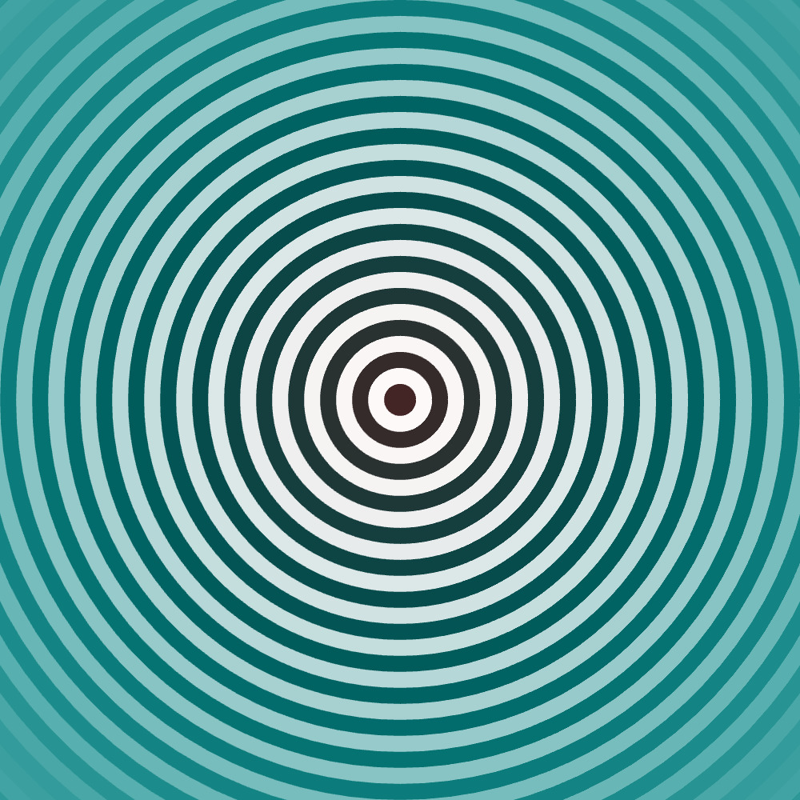
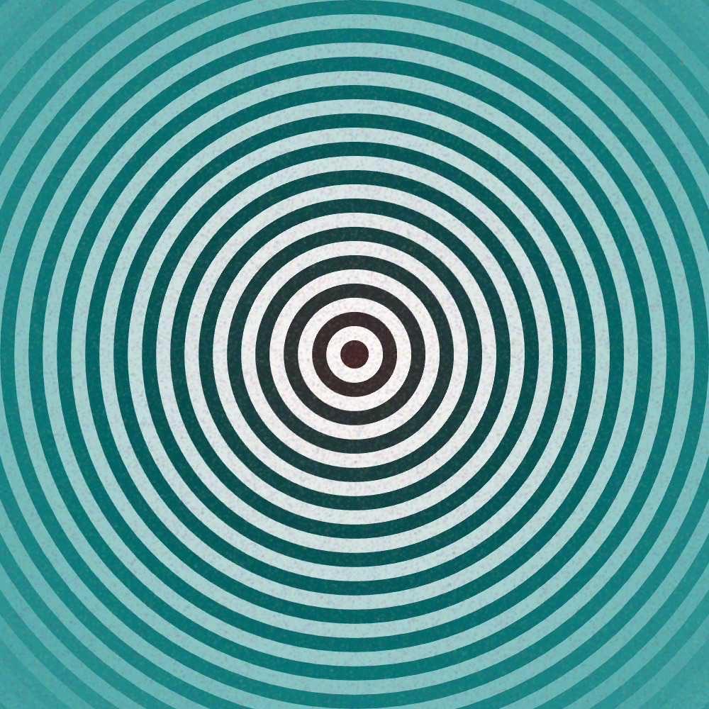
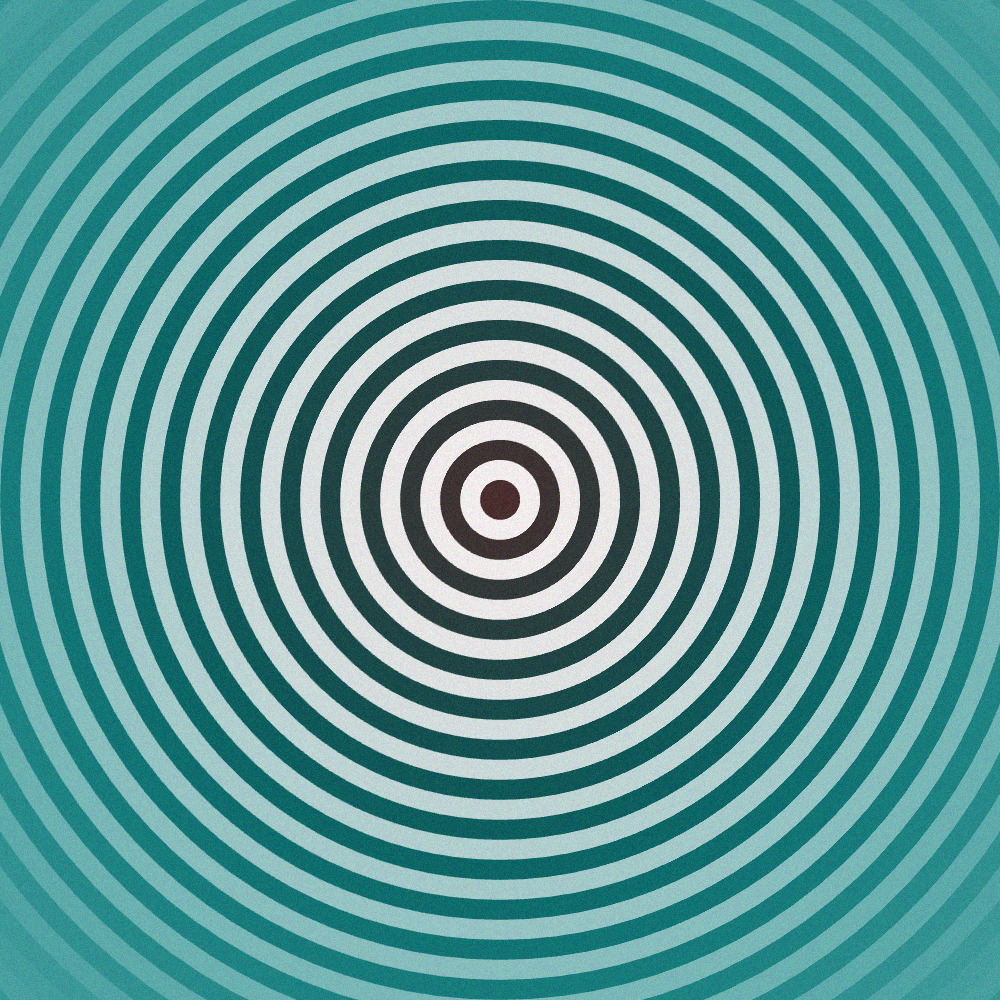
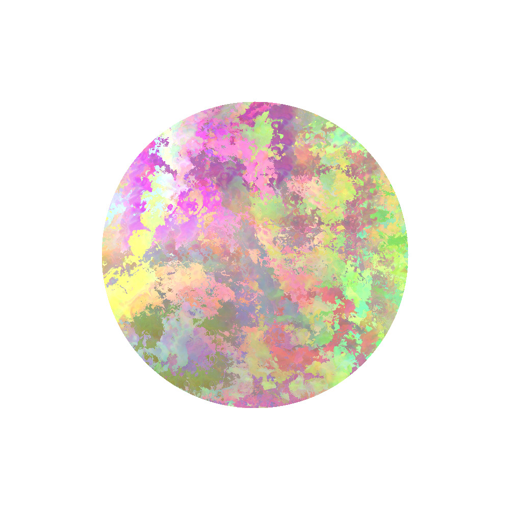
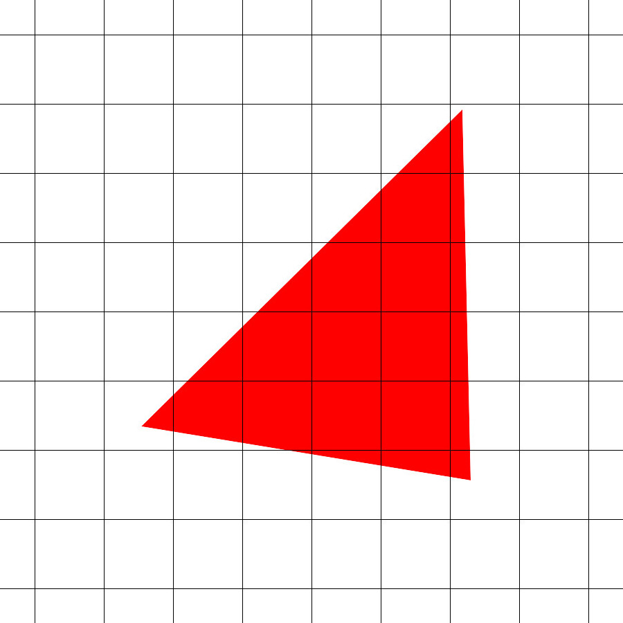
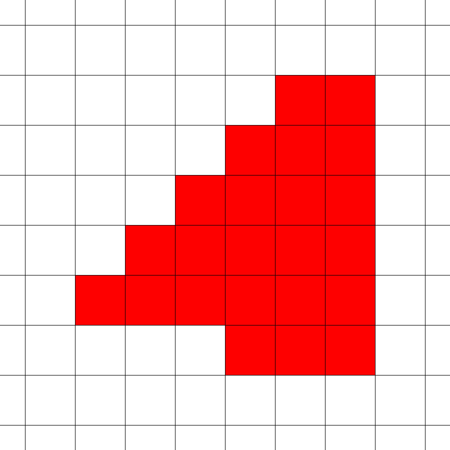
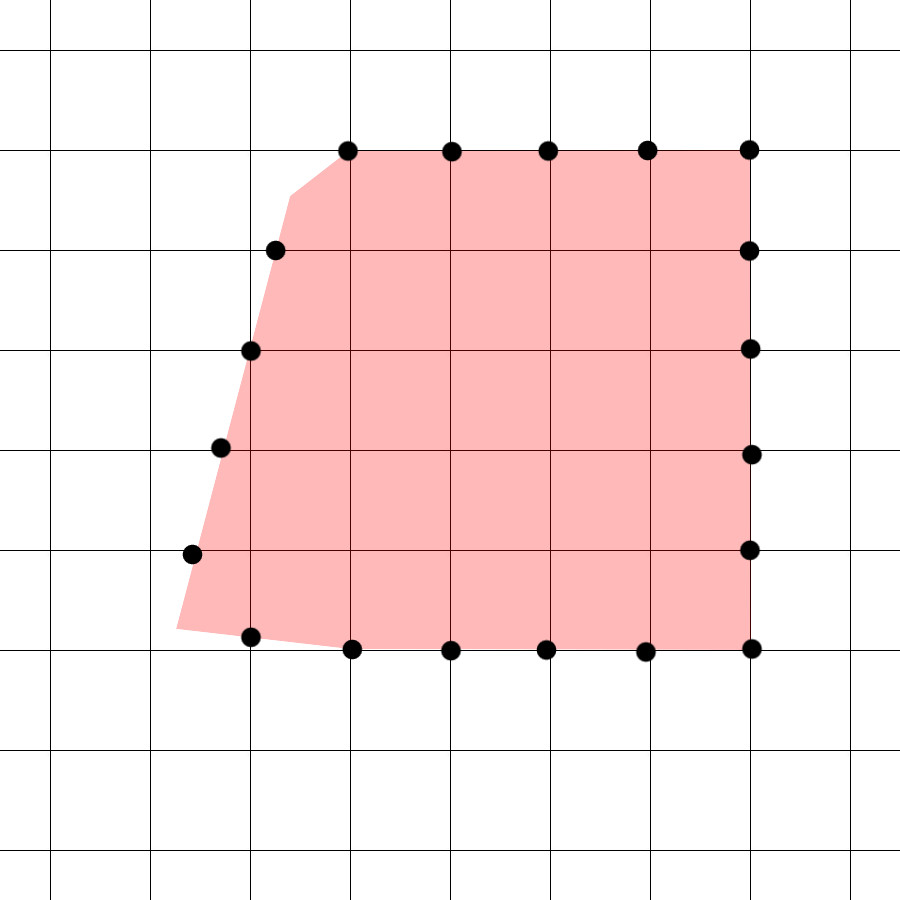
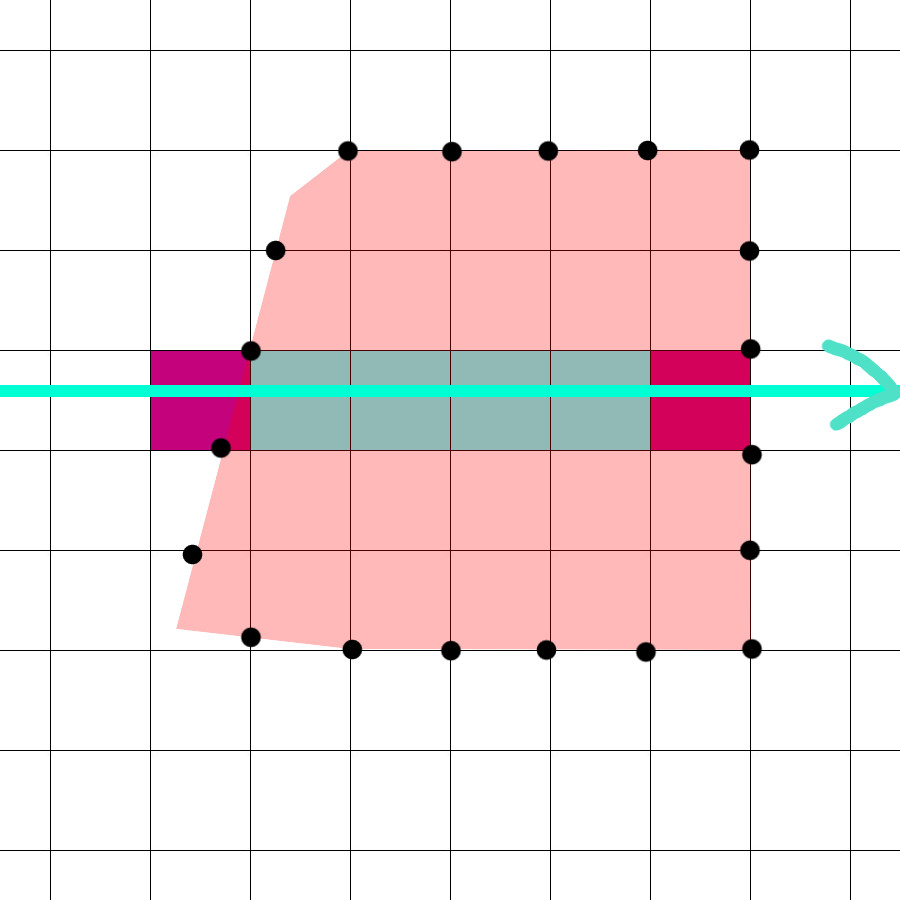

+++
title = "Valora's Rasterizer"
date = 2019-11-03
description = "An argument for valora's rasterizer"
draft = false

[extra]
rss_include = true
+++

Writing generative art is necessarily explorative. It requires prototyping ideas to see how they
look, then deciding whether to go deeper on that path or discard them, at recursive granularity. I
think it is important that a drawing library for generative art provides ways to commit gradually to
ideas to facilitate this exploration.

I don’t think this exists today, so I am writing [valora](https://github.com/turnage/valora), a focused drawing library for generative
fine art for print and no other purpose. In this article I’ll explain how its core, a custom
rasterizer, enables an API that lets artists commit gradually to their ideas.

## Communicating Graphics

There are two basic ways to communicate graphics to a computer:

* Vector graphics are paths in a space of theoretically infinite resolution that describe shapes and
  strokes. SVGs, the shapes we draw in Cairo or Processing, and Adobe Illustrator files are examples
  of vector graphics.
* Raster graphics are mappings from pixel coordinates to a color. Image files, ray tracers, GLSL
  fragment shaders, and pixel art are examples of raster graphics.

It is trivially easy to come up with ideas when working on a piece that are more suited for one mode
than the other, but most drawing tools support only one mode, or very limited interop.

## Case Study: Noise

Suppose you have this image and want to add noise.

If you are working in a vector graphics drawing library, you might try to draw many small circles at low opacity to simulate noise.

Unfortunately, these 100,000 circles are not even close to the granularity you need for the noise in
your imagination, and the render time has already quintupled, slowing your iteration speed.

If instead you could run a shader on the GPU at the end which selects a random color at a low opacity for each pixel, you’d get perfect granularity noise and your render time wouldn’t even measurably change.

I think an ergonomic integration between the GPU and CPU in the API is essential. Anything less artificially constrains what can be communicated to the machine. Both of these processors exist, and artists should have access to both.

## Case Study: Complex Shader

Consider that you have this image and want to shade the circle with simplex noise.

You could write a shader for the GPU to do it, but code sharing for shaders is notoriously hard. You
would probably have to implement simplex noise yourself, which is a big task. You would also need to
negotiate uniforms with the implementation to ensure the noise is connected to your random number
generation scheme on CPU side.

You already have a noise library CPU side--if you could just shade on the CPU first and see how it looks, even if it is slow, that could inform whether you invest the effort in the GPU shader.

Access to the GPU is essential, but a mandate to use it for all raster graphics means artists have to commit to the complexity of implementing an algorithm across two processors just to see how it might look.

## Valora's Rasterizer

In the end the product must be an image file, a raster graphic. That’s why we need a rasterizer. A
rasterizer takes vector graphics and determines how which pixels to shade to represent them in
raster graphics.

Through rasterization, this vector triangle becomes:

For a refresher on the basics, read my article from two years ago on [scanline rasterization](/water_color).

Valora’s rasterizer tackles these design challenges:

* It must not care whether the shade commands are executed on CPU or GPU so artists can choose.
* It needs to be fast enough for artists to iterate, even with complex scenes.
* It must not tessellate because generative art is full of strange and small shapes that either trip up tessellating rasterizers or simply cost too much to tessellate.

Its design is inspired by this [research
paper](http://kunzhou.net/zjugaps/pathrendering/GPUpathrendering.pdf) authored by Rui Lui, Qiming
Hou, and Kun Zhou. 

### Spans

The rasterizer uses scanlines, but not per pixel as in my article from two years ago. Instead it breaks each path into its edges and finds the intersections each edge has with the lines of the pixel grid.

These intersections are sorted into rows, then left to right within those rows, and stored for processing by a second pass.

The second pass goes left to right on each row and identifies boundaries, which are pixels
that contain an edge (purple), and spans, which are sequences of adjacent pixels completely covered by the
path (bluegreen).

Anti-aliasing work is performed on the boundaries, and the spans are known to have 100% coverage.

### Shading

As output the rasterizer yields lines with a coverage annotation in the range [0, 1]. Boundaries are one pixel lines. These can be sent to the hardware rasterizer as line primitives, or a shader can be run on CPU to modify the pixels in a buffer in RAM.

## Conclusion

This rasterizer design makes valora possible.

Liberating the rasterizer from the drawing pipeline allows artists to re-use its work. Artists can
use it to explore raster graphics on CPU with low commitment, or operate on paths such as by
applying boolean operations to them, performing hit detection, and path offsetting.
