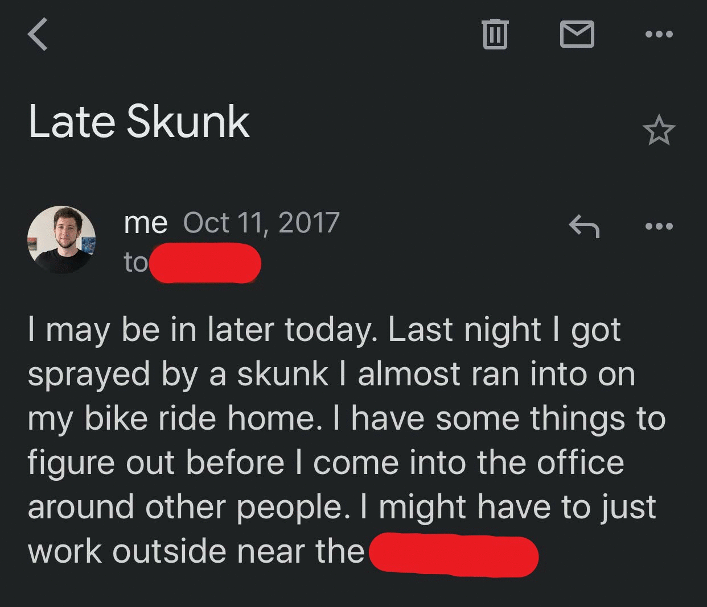
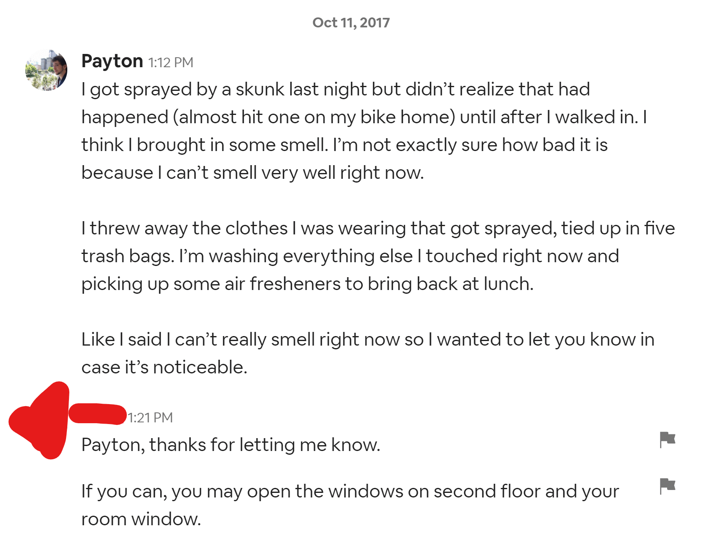

+++
title = "When The Skunk Attacked"
date = 2020-11-10
description = "An adventure in the olfactory."
draft = false
aliases = []

[extra]
rss_include = true
+++

The year was 2017. The month was October, therefore California was on fire#!There is nothing special about October. California is always on fire.!#. I was biking home from the office where I had just put in an earnest day's work as an intern, fiddling with computer bits, scuba diving in documentation so no one would think I asked too many questions, and inquiring only about height when instructed to jump, down to the bootlicking units like millimeters. I had to alchemize that internship into an offer with salary before I graduated the next semester. These offers usually come in e-signable pdfs over email, and I intended to spend the salary on food, water, and rent on an ongoing basis. Anyway, I was biking home late at night when I saw it.

An adorable little skunk stood still on the curb to my right, staring at the forest across the street. I visualized the skunk's potential path and my own. His was a crosswise line over the road and mine lengthwise, and they met at an ominous intersection about two meters ahead of my position. My empathy for animals is the involuntary but tedious kind, where it bothers me a little to know that someone somewhere is drinking milk, so I lean into the handlebars and steer sharp to the left, stupidly risking my upright position on the bike.

Impact. It didn't compute for me, the how of it. My arc left gave him a whole extra meter of safety, but he wormholed from the curb to underneath my rear tire at a speed that dared you to perceive it. The first sign that he had left the curb was the badoomp sound of oh god what have I run over just now. When I looked down I saw a black and white gaussian blur bolting into the woods, and I finally noticed the smoke smell everyone in the bay area had been talking about wafting in from the forest fires the past few days. 

It wasn't until I got home and closed the door that I began to suspect the source of that potent "forest fire" smell, which is an unflattering detail of this story. Indoors it was able to _accumulate_. The air thickened until I could hardly inhale it. Within five minutes I vomitted for the first time.

What most people don't realize about the skunk smells they've suffered is that they came from a skunk kilometers away. Skunks have spent millions of years evolving an odor so painful that its predators would rather starve to death than experience it, and they did not slack. Up close it transcends whatever isolated network in the brain interprets olfactory input. It escapes this containment and reaches tendrils into other parts of the brain to muck with proprioception, optics, and your sense of time. There is no use describing it as a sensation because after a few minutes you sort of stop sensing entirely and depersonalize. After that all that's on your DEFCON 5 mind is how do you make whatever is happening right now end and never happen again?

While I was purchasing every can of tomato soup available at the supermarket, mothers at the far end of the long aisle tucked their noses into their shirt collars and guided their children away with maternal hands on their shoulders. Others turned the corner into the aisle and then spun around on their heel and retreated with instinctual urgency. The cashier waved me away before I could approach and pointed at self-checkout with both arms.

A note to those unfortunate few of you who will in the future suffer the direct attention of a skunk: it doesn't work. The tomato soup. The oatmeal doesn't work either.

I slept with a clothespin sealing my nostrils (which somehow provided only incomplete relief) and sent this email to my boss in the morning:

Yeah, I lied about the hitting versus "almost" hitting issue. In my defense it's not clear to me whether I hit him or he hit me, but "getting hit by" a skunk begs the visualization of me minding my own business when suddenly _skunk_, and that invites more questions than it answers. I also didn't want it to seem like I was the kind of guy that goes around hitting skunks and just got what was coming to him. Maybe not a rational fear. I'm not here to defend every email I've ever sent.

I spent three days in abject suffering, smelling it, unable to escape the smell because it was myself I was smelling. At the office I sat on the patio outside, just within range of the corporate wifi.

My landlord had notified all my co-renters that "one of their housemates" had been sprayed by a skunk after I sent him this message:

I shared the house with a Canadian woman and a French man. They arrived in September and both of them taxied straight from their first landing in the United States at SFO International to the house, to start work for the same company I was interning with. I'll remind you this took place in 2017, so the Trump issue and foreigner confusion over it was fresh. When they settled their belongings in their rooms and came upstairs to the kitchen they found me, the first American they'd observed in his natural habitat, and wasted no time putting me to the question—not in an accusatory way, but in an earnest anthropological sort of way—about what exactly the hell America thought it was getting up to lately#!I believe the issue at the time had to do with Puerto Rico not receiving federal aid after a hurricane.!#. It happened that at the time of their arrival to the kitchen I was already sitting at the table with a mammoth portion of microwaved potatoes and mushrooms and garlic (I think three or four entire cloves; I love garlic), chowing down with the slotted spoon. I binge ate on Sundays at 5pm because I couldn't be assed to cook multiple times a day, and opted instead to ingest all 4500 of my athletically-necessary calories in one utilitarian mixture. I was hunched over this gargantuan pot of potatoes releasing with every exhale more garlic than a reasonable person would eat in a year. The impression of me as a smelly animal was already made for them. They did not hesitate to assume which unnamed housemate got into a conflict with a skunk.

But that's what gave me the idea that saved me in the end. I remembered that stupid animals get sprayed by skunks all the time, and one thing I appreciate about America is that if you have a problem, someone is trying to sell you a quick and easy solution in an underregulated market#!In the United States you can get a methamphetamine prescription for exogenous obesity.!#. I pedaled as fast as I could toward PetCo, and then slowed down a bit because my cardio was ok but not conditioned enough to sustain that pace all the way to El Camino Road [sic]. Just inside the store and on prominent display—maybe to discourage people who needed the product from sticking around too long—I found skunk shampoo for dogs. Ignoring all the warnings that said things like "do not apply to humans" and "for dogs only", I dumped the entire bottle on myself in the shower.

Like microwaving a potato, it did the trick. I returned to the office a victor and was greeted by applause#!I was not greeted by applause.!#.

